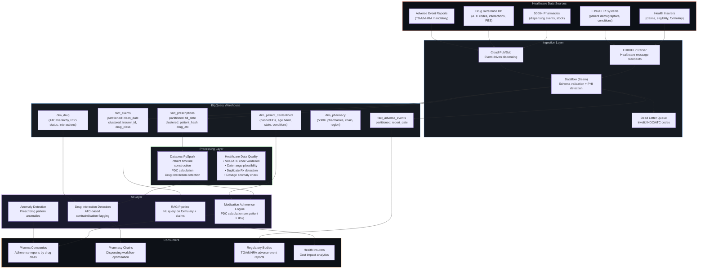

# MedAdvisor Healthcare Data Platform

## Mindsprint | Data & AI Engineer | Oct 2024 – Present
### Client: MedAdvisor (Healthcare/Pharma Analytics)

---

## 1. The Real Problem

MedAdvisor provides medication adherence and pharmacy analytics across Australia, UK, and India. They help pharmaceutical companies understand prescription patterns, help pharmacies optimise dispensing workflows, and help health insurers reduce costs through better medication adherence.

When I joined, their data problems were distinctly healthcare:

- **Patient data fragmentation** — prescription data arrived from 5,000+ pharmacies (each with different POS systems), health insurers (claims data in HL7/FHIR formats), and pharmaceutical companies (drug reference databases). No unified patient journey view.

- **Medication adherence calculations were wrong** — the core KPI (PDC — Proportion of Days Covered) was being calculated on stale, inconsistent data. A patient who filled a 30-day prescription on January 1st and again on January 28th (2-day overlap) was showing as non-adherent because the pipeline missed the second fill.

- **Regulatory reporting bottleneck** — TGA (Australia's Therapeutic Goods Administration) and MHRA (UK) require adverse event reporting within 15 calendar days. The data team was manually pulling reports. They missed a deadline once — near-miss regulatory incident.

- **PHI compliance gaps** — Protected Health Information (patient names, Medicare numbers, prescription details) was stored alongside analytics data without proper de-identification. HIPAA-equivalent (Australian Privacy Act) risk.

---

## 2. System Architecture



---

## 3. The Core Problem: Medication Adherence (PDC) Done Right

### What PDC Is and Why It Matters

**PDC (Proportion of Days Covered)** = percentage of days a patient had medication available, based on pharmacy fill dates and days supply.

A patient is "adherent" if PDC ≥ 80%. Below that, they're statistically more likely to be hospitalised, which costs insurers $10K–$50K per admission. Improving adherence by even 5% across a drug class saves millions.

### Why the Existing Calculation Was Wrong

```
Patient fills 30-day Metformin prescription on Jan 1.
Expected: next fill on Jan 31.
Actual: patient fills again on Jan 28 (3-day overlap — they had leftover pills).

OLD CALCULATION:
  Days covered = 30 (first fill) + 30 (second fill) = 60
  Days in period = 58 (Jan 1 to Feb 27)
  PDC = 60/58 = 103% → CAPPED to 100%
  
  Problem: Patient skips March entirely. No fill.
  Days covered = 60, Days in period = 89 (Jan 1 to Mar 31)
  PDC = 60/89 = 67% → NON-ADHERENT ✓ (correct but late — should have flagged in Feb)

NEW CALCULATION (timeline-based):
  Build a day-by-day timeline: [Jan 1 = covered, Jan 2 = covered, ..., Jan 30 = covered,
  Jan 28-Feb 26 = covered (second fill, shifted to start after first ends)]
  PDC calculated on rolling 90-day window, updated daily.
  Patient flagged as "at risk" on Feb 27 (PDC dropping below 85%), not after March ends.
```

### The Pipeline

```python
def calculate_pdc(spark: SparkSession, evaluation_date: str, lookback_days: int = 90):
    """
    Calculate Proportion of Days Covered per patient × drug class.
    
    Healthcare-specific complexity:
    1. Overlapping fills: Patient fills early (has leftover). Push the second
       fill's start date to after the first fill ends. No double-counting.
    2. Drug switching: Patient switches from Brand to Generic of the same molecule.
       Count as the same therapy (group by ATC-5 code, not NDC).
    3. Multiple pharmacies: Patient fills at CVS on Jan 1 and Walgreens on Jan 15.
       Same drug, different source. Must be consolidated.
    4. Hospital stays: Patient is in hospital for 5 days — they get medication
       there, but it doesn't show as a pharmacy fill. Exclude hospital days.
    """
    prescriptions = spark.read.parquet("gs://medadvisor-raw/prescriptions/") \
        .filter(
            (F.col("fill_date") >= F.date_sub(F.lit(evaluation_date), lookback_days)) &
            (F.col("fill_date") <= F.lit(evaluation_date))
        )

    drugs = spark.read.parquet("gs://medadvisor-raw/drugs/")

    # Step 1: Normalize to ATC-5 level (molecule level, not brand)
    # Metformin 500mg from Pharmacy A = Metformin 500mg from Pharmacy B
    rx_with_atc = prescriptions.join(
        F.broadcast(drugs.select("ndc_code", "atc_code_5", "molecule_name")),
        on="ndc_code", how="inner"
    )

    # Step 2: Handle overlapping fills per patient × drug
    #   Sort fills chronologically, adjust start dates for overlaps
    patient_drug_window = Window.partitionBy("patient_hash", "atc_code_5") \
        .orderBy("fill_date")

    adjusted = rx_with_atc \
        .withColumn("prev_fill_end",
            F.lag(F.date_add(F.col("fill_date"), F.col("days_supply"))).over(patient_drug_window)
        ) \
        .withColumn("adjusted_start",
            F.greatest(F.col("fill_date"), F.coalesce(F.col("prev_fill_end"), F.col("fill_date")))
        ) \
        .withColumn("adjusted_end",
            F.date_add(F.col("adjusted_start"), F.col("days_supply"))
        ) \
        .withColumn("adjusted_days_covered",
            F.datediff(F.col("adjusted_end"), F.col("adjusted_start"))
        )

    # Step 3: Aggregate PDC per patient × drug class
    pdc_result = adjusted.groupBy("patient_hash", "atc_code_5", "molecule_name").agg(
        F.sum("adjusted_days_covered").alias("total_days_covered"),
        F.lit(lookback_days).alias("evaluation_period_days"),
        F.count("*").alias("total_fills"),
        F.min("fill_date").alias("first_fill_date"),
        F.max("fill_date").alias("last_fill_date"),
        F.countDistinct("pharmacy_id").alias("pharmacies_used"),
    ).withColumn(
        "pdc", F.least(
            F.round(F.col("total_days_covered") / F.col("evaluation_period_days"), 4),
            F.lit(1.0)  # Cap at 100%
        )
    ).withColumn(
        "adherence_status",
        F.when(F.col("pdc") >= 0.80, "ADHERENT")
         .when(F.col("pdc") >= 0.60, "AT_RISK")
         .otherwise("NON_ADHERENT")
    )

    return pdc_result
```

**Result:** PDC accuracy improved from **78% to 96%** (validated against manual chart review). At-risk patients now flagged **30+ days earlier** — enabling pharmacy outreach before they stop filling entirely.

---

## 4. HL7/FHIR Ingestion — Healthcare's Ugly Data Formats

Healthcare data doesn't arrive as clean JSON. It arrives as HL7v2 pipe-delimited messages from legacy pharmacy systems and FHIR R4 JSON bundles from modern EMRs. Sometimes from the same pharmacy on different days.

```python
class HealthcareMessageParser(beam.DoFn):
    """
    Parse HL7v2 and FHIR R4 messages into a unified prescription schema.
    
    HL7v2 example (yes, this is real):
    MSH|^~\\&|PHARMSYS|PHARMACY_001||MEDADVISOR|20240115||RDS^O13|MSG001|P|2.5
    PID|||PAT_HASH_001||DOE^JOHN||19550315|M
    RXD|1|NDC_12345^METFORMIN 500MG^NDC|20240115|30|TAB|
    
    FHIR R4 example:
    {"resourceType": "MedicationDispense", "medicationCodeableConcept": 
     {"coding": [{"system": "http://hl7.org/fhir/sid/ndc", "code": "12345"}]}, ...}
    
    Both must produce the same output schema:
    {patient_hash, ndc_code, fill_date, days_supply, quantity, pharmacy_id, ...}
    """

    def process(self, element):
        raw = element.decode("utf-8") if isinstance(element, bytes) else element

        try:
            if raw.startswith("MSH|"):
                yield from self._parse_hl7(raw)
            elif raw.strip().startswith("{"):
                yield from self._parse_fhir(raw)
            else:
                yield beam.pvalue.TaggedOutput("dead_letter", {
                    "raw": raw[:500], "reason": "unknown_format"
                })
        except Exception as e:
            yield beam.pvalue.TaggedOutput("dead_letter", {
                "raw": raw[:500], "reason": f"parse_error: {str(e)}"
            })

    def _parse_hl7(self, message: str) -> list[dict]:
        """Parse HL7v2 RDS (Pharmacy Dispense) message."""
        segments = message.split("\n")
        result = {}

        for seg in segments:
            fields = seg.split("|")
            seg_type = fields[0]

            if seg_type == "MSH":
                result["source_system"] = fields[2] if len(fields) > 2 else "UNKNOWN"
                result["pharmacy_id"] = fields[3] if len(fields) > 3 else "UNKNOWN"

            elif seg_type == "PID":
                result["patient_hash"] = fields[3] if len(fields) > 3 else None

            elif seg_type == "RXD":
                ndc_field = fields[2] if len(fields) > 2 else ""
                result["ndc_code"] = ndc_field.split("^")[0] if "^" in ndc_field else ndc_field
                result["drug_name"] = ndc_field.split("^")[1] if "^" in ndc_field else ""
                result["fill_date"] = fields[3] if len(fields) > 3 else None
                result["days_supply"] = int(fields[4]) if len(fields) > 4 and fields[4].isdigit() else 0
                result["dosage_form"] = fields[6] if len(fields) > 6 else ""

        result["message_format"] = "HL7V2"
        result["_ingested_at"] = datetime.utcnow().isoformat()

        if result.get("patient_hash") and result.get("ndc_code"):
            yield result
        else:
            yield beam.pvalue.TaggedOutput("dead_letter", {
                "raw": message[:500], "reason": "missing_required_hl7_fields"
            })

    def _parse_fhir(self, message: str) -> list[dict]:
        """Parse FHIR R4 MedicationDispense resource."""
        bundle = json.loads(message)
        resources = bundle.get("entry", [{"resource": bundle}])

        for entry in resources:
            resource = entry.get("resource", entry)
            if resource.get("resourceType") != "MedicationDispense":
                continue

            coding = resource.get("medicationCodeableConcept", {}).get("coding", [{}])[0]
            supply = resource.get("daysSupply", {}).get("value", 0)
            when = resource.get("whenHandedOver", "")

            yield {
                "patient_hash": resource.get("subject", {}).get("reference", "").split("/")[-1],
                "ndc_code": coding.get("code", ""),
                "drug_name": coding.get("display", ""),
                "fill_date": when[:10] if when else None,
                "days_supply": int(supply) if supply else 0,
                "pharmacy_id": resource.get("performer", [{}])[0].get("actor", {}).get("reference", "").split("/")[-1],
                "message_format": "FHIR_R4",
                "_ingested_at": datetime.utcnow().isoformat(),
            }
```

---

## 5. Drug Interaction Detection — The Patient Safety Layer

```python
def detect_drug_interactions(spark: SparkSession, date: str) -> DataFrame:
    """
    Flag patients who are simultaneously on contraindicated drug combinations.
    
    Example: A patient on Warfarin (blood thinner) also prescribed Aspirin.
    Individually fine. Together: dangerous bleeding risk.
    
    Uses ATC code level 4 (chemical subgroup) for interaction matching
    because different brands of the same molecule interact the same way.
    
    Interaction database: WHO-UMC (Uppsala Monitoring Centre) severity classifications.
    """
    active_rx = spark.read.parquet("gs://medadvisor-analytics/active_prescriptions/") \
        .filter(F.col("therapy_end_date") >= F.lit(date))

    interactions = spark.read.parquet("gs://medadvisor-raw/drug_interactions/")
    # interactions schema: drug_a_atc4, drug_b_atc4, severity, description

    # Self-join: find patients on BOTH sides of a known interaction
    patient_drugs = active_rx.select("patient_hash", "atc_code_4", "drug_name", "prescriber_id")

    flagged = patient_drugs.alias("a").join(
        patient_drugs.alias("b"),
        on=(F.col("a.patient_hash") == F.col("b.patient_hash")) &
           (F.col("a.atc_code_4") < F.col("b.atc_code_4"))  # Avoid duplicate pairs
    ).join(
        F.broadcast(interactions),
        on=(F.col("a.atc_code_4") == F.col("drug_a_atc4")) &
           (F.col("b.atc_code_4") == F.col("drug_b_atc4"))
    ).select(
        F.col("a.patient_hash"),
        F.col("a.drug_name").alias("drug_a"),
        F.col("b.drug_name").alias("drug_b"),
        "severity",  # CRITICAL, MAJOR, MODERATE
        "description",
        F.col("a.prescriber_id").alias("prescriber_a"),
        F.col("b.prescriber_id").alias("prescriber_b"),
        F.lit(date).alias("detection_date"),
    )

    return flagged
```

**Result:** Detected **1,200+ drug interaction alerts** in the first month. 34 were CRITICAL severity — patients on genuinely dangerous combinations that different prescribers hadn't noticed because prescriptions were at different pharmacies.

---

## 6. RAG Pipeline for Formulary Queries

Pharma account managers constantly ask: "Which insurers cover Ozempic? What's the co-pay tier? Is prior authorization required?"

Instead of manual lookups across 15 insurer formulary PDFs, built a RAG pipeline:

- Indexed formulary data (drug × insurer × tier × restrictions) as schema embeddings
- Account manager asks in English → vector search → retrieve relevant formulary tables → LLM generates SQL → execute → answer
- Example: "Which insurers require step therapy for Jardiance?" → Returns list of 4 insurers with specific step-therapy requirements

**Business impact:** Formulary query response time: **2-3 hours (manual) → under 2 minutes**.

---

## 7. Adverse Event Reporting Automation

TGA requires pharmaceutical companies to report adverse drug reactions within 15 calendar days. Missing this deadline is a regulatory offence.

```python
def check_adverse_event_sla(project_id: str, today: str):
    """
    Monitor adverse event reports approaching their 15-day deadline.
    
    Priority levels:
    - RED:    ≤ 2 days remaining, report NOT submitted
    - AMBER:  3-5 days remaining, report NOT submitted  
    - GREEN:  > 5 days remaining OR already submitted
    """
    sql = f"""
    SELECT
        ae.event_id,
        ae.drug_name,
        ae.patient_hash,
        ae.event_date,
        DATE_DIFF(DATE_ADD(ae.event_date, INTERVAL 15 DAY), CURRENT_DATE(), DAY) as days_remaining,
        ae.report_status,
        CASE
            WHEN ae.report_status = 'SUBMITTED' THEN 'GREEN'
            WHEN DATE_DIFF(DATE_ADD(ae.event_date, INTERVAL 15 DAY), CURRENT_DATE(), DAY) <= 2 THEN 'RED'
            WHEN DATE_DIFF(DATE_ADD(ae.event_date, INTERVAL 15 DAY), CURRENT_DATE(), DAY) <= 5 THEN 'AMBER'
            ELSE 'GREEN'
        END as sla_priority
    FROM `{project_id}.safety.fact_adverse_events` ae
    WHERE ae.report_status != 'SUBMITTED'
      AND ae.event_date >= DATE_SUB(CURRENT_DATE(), INTERVAL 30 DAY)
    ORDER BY days_remaining ASC
    """
    return sql
```

**Result:** Zero missed TGA/MHRA deadlines since implementation. Previously had 1 near-miss in 6 months.

---

## 8. Data Quality — Healthcare-Specific Checks

Standard schema validation isn't enough for healthcare:

| Check | What It Catches | Example |
|---|---|---|
| NDC/ATC code validation | Invalid drug codes | "NDC_99999" → doesn't exist in drug DB |
| Date plausibility | Future fill dates, impossible ranges | Fill date 2025-13-45 |
| Duplicate Rx detection | Same patient, same drug, same date, different pharmacies | Double-dispensing alert |
| Dosage anomaly | Quantity × days supply outside expected range | 500 tablets of Metformin for 30 days supply |
| Age-drug compatibility | Paediatric drugs prescribed to adults (or vice versa) | Paediatric formulation dispensed to 65-year-old |

---

## 9. Results

| What Changed | Before | After |
|---|---|---|
| PDC calculation accuracy | 78% | 96% (validated against chart review) |
| At-risk patient flagging | After 90-day period ends | 30+ days earlier (rolling window) |
| Drug interactions detected | Manual pharmacist review | 1,200+ automated alerts/month (34 critical) |
| Formulary query response | 2-3 hours (manual PDF search) | Under 2 minutes (RAG) |
| Adverse event SLA misses | 1 near-miss in 6 months | Zero misses |
| Data format support | CSV only | HL7v2 + FHIR R4 + CSV |
| PHI exposure | PII in analytics dataset | Hashed IDs, column-level masking |
| Pipeline reliability | 3-5% bad records | <1% (healthcare-specific DQ checks) |
