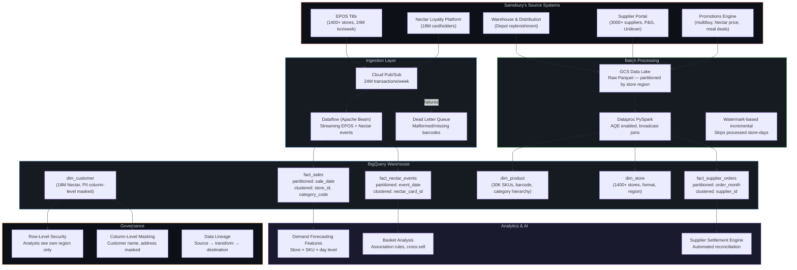

# Sainsbury's Retail Data Platform @ Scale

## Tata Consultancy Services | Data Engineer | Aug 2021 – Oct 2024
### Client: Sainsbury's (UK's 2nd Largest Grocery Retailer)

---

## 1. The Real Problem

Sainsbury's operates 1,400+ stores across the UK, processes 24M customer transactions per week, manages 30,000+ SKUs per supermarket, and runs a Nectar loyalty programme with 18M active cardholders. Their data challenges are uniquely grocery-retail:

- **Demand forecasting lag** — store replenishment ran on batch data that was 6-8 hours stale. For fresh produce (bakery, dairy, ready meals), this meant systematic overstocking (25% waste on short-shelf items) or stockouts (12% lost revenue on promotional items).

- **Nectar loyalty data unusable at scale** — 18M cardholders generate 120M+ Nectar events/week (scans, points earned, redeemed, partner transactions). The Spark pipeline processing loyalty joins took 5+ hours because a handful of power shoppers (1,500+ transactions/month) skewed the customer_id join 200:1.

- **Supplier settlement nightmare** — Sainsbury's negotiates cost-price agreements with 3,000+ suppliers (Unilever, Procter & Gamble, own-label manufacturers). Monthly settlement required joining order data with delivery confirmations, promotional allowances, and markdown claims across 4 legacy systems. Finance team was taking 10 days to close month-end.

- **GDPR compliance risk** — customer PII (names, addresses, Nectar card data) was scattered across multiple BigQuery datasets without row-level security. A junior analyst could query full customer names alongside purchase history. ICO (UK data authority) could fine up to £17.5M for a breach.

---

## 2. System Architecture



---

## 3. Store Replenishment: Why Stale Data Costs Millions in Grocery

### The 6-Hour Lag Problem

Grocery is different from every other retail vertical because of **perishability**. A laptop sits on a shelf for months. A ready meal has a 3-day shelf life. A bakery croissant has 8 hours.

The replenishment system ran on a nightly batch from EPOS tills. At 6 AM, it calculated what to order from the depot based on yesterday's sales. But by 6 AM, the morning rush has already started:

- Milk sold out at 7:30 AM — replenishment won't know until tonight
- 200 croissants arrived at 5 AM based on yesterday's demand — today is a bank holiday and demand is 50% lower, 100 go to waste
- A multibuy promotion on pasta went viral on social media — stores can't react until tomorrow's replenishment run

### What I Built: Near-Real-Time EPOS Streaming

```python
class EPOSSaleEventFn(beam.DoFn):
    """
    Process EPOS (Electronic Point of Sale) events in near real-time.
    
    Sainsbury's EPOS tills send a sale event per scanned item.
    Events arrive via Pub/Sub — one subscription per store region
    (London, South East, Midlands, North, Scotland, Wales).
    
    Why regional subscriptions?
    - Ordering isolation: a bad batch of London events doesn't block Scotland
    - Independent scaling: London stores generate 8x more events than Wales
    - Regional teams can manage their own alerting thresholds
    
    What makes grocery EPOS data messy:
    - Barcodes for weighed items (fruit, meat) are store-generated, not EAN-13
    - Multibuy promotions (3 for £5) split the discount across items
    - Staff discount events have different PII handling requirements
    """

    WEIGHED_BARCODE_PREFIX = "2"  # Internal weighing barcodes start with 2

    def process(self, element):
        event = json.loads(element.decode("utf-8"))

        # --- Validate mandatory fields ---
        required = ["store_id", "barcode", "quantity", "sale_price_pence", "till_id", "timestamp"]
        missing = [f for f in required if f not in event or event[f] is None]
        if missing:
            yield beam.pvalue.TaggedOutput("dead_letter", {
                "event": event, "reason": f"missing_fields: {missing}"
            })
            return

        # --- Handle weighed items (store-generated barcodes) ---
        if str(event["barcode"]).startswith(self.WEIGHED_BARCODE_PREFIX):
            event["barcode_type"] = "WEIGHED"
            # Extract embedded product code and weight from barcode
            # Format: 2PPPPPPWWWWWC (P=product, W=weight in grams, C=check)
            event["product_code"] = str(event["barcode"])[1:7]
            event["weight_grams"] = int(str(event["barcode"])[7:12])
        else:
            event["barcode_type"] = "EAN13"

        # --- Denormalise promotion ---
        if event.get("promotion_id"):
            event["is_promoted"] = True
            event["promotion_type"] = event.get("promotion_type", "UNKNOWN")
        else:
            event["is_promoted"] = False

        # --- Convert pence to pounds for analytics ---
        event["sale_price_gbp"] = round(event["sale_price_pence"] / 100.0, 2)

        # --- Partition key ---
        event["sale_date"] = event["timestamp"][:10]
        event["store_region"] = self._store_to_region(event["store_id"])

        yield event

    def _store_to_region(self, store_id: str) -> str:
        """Map store ID to region. In production: lookup from dim_store cache."""
        region_map = {
            "LON": "london", "SE": "south_east", "MID": "midlands",
            "NTH": "north", "SCO": "scotland", "WAL": "wales"
        }
        prefix = store_id[:3] if len(store_id) >= 3 else "UNK"
        return region_map.get(prefix, "other")
```

**Result:** Store managers now see sales velocity updated every 5 minutes. Depot replenishment orders can be adjusted intra-day. Fresh produce waste on short-shelf items: **reduced 18%** across pilot stores.

---

## 4. The Nectar Loyalty Skew — 200:1 Power Shoppers

18M Nectar cardholders, but the top 500 "power shoppers" generate 1,500+ transactions per month (they use Nectar for everything — fuel, Tu clothing, Argos, partner offers). When you join `fact_sales` to `fact_nectar_events` on `nectar_card_id`, those 500 users create 200:1 data skew.

### What I Tried First (That Failed)

1. **AQE alone**: `spark.sql.adaptive.skewJoin.enabled = true`. AQE splits skewed partitions when skew exceeds 5x median. At 200x, the split partitions were still 40x larger than normal — executors ran out of memory.

2. **Increasing executor memory to 16GB**: Delayed the OOM by 20 minutes. Same result.

### The Actual Fix: Pre-Aggregate Then Join

```python
def join_nectar_to_sales(spark: SparkSession, date: str) -> DataFrame:
    """
    Join Nectar loyalty events to EPOS sales without hitting the 200:1 skew.
    
    Key insight: we don't need per-transaction Nectar details in the sales fact.
    We need per-customer-per-day aggregates:
    - Total Nectar points earned today
    - Total Nectar points redeemed today
    - Number of Nectar partner transactions
    
    By pre-aggregating Nectar events to customer-day level BEFORE the join,
    the skewed 1,500-transaction power shopper becomes ONE row per day.
    Join ratio: 1:1 instead of 1:200.
    """
    sales = spark.read.parquet(f"gs://sainsburys-raw/epos/sale_date={date}/")
    nectar = spark.read.parquet(f"gs://sainsburys-raw/nectar/event_date={date}/")

    # Pre-aggregate Nectar to customer-day level (1 row per customer per day)
    nectar_daily = nectar.groupBy("nectar_card_id", "event_date").agg(
        F.sum(F.when(F.col("event_type") == "EARN", F.col("points")).otherwise(0))
         .alias("points_earned_today"),
        F.sum(F.when(F.col("event_type") == "REDEEM", F.col("points")).otherwise(0))
         .alias("points_redeemed_today"),
        F.countDistinct(F.when(F.col("source") != "SAINSBURYS", F.col("partner_name")))
         .alias("partner_brands_today"),
        F.count("*").alias("total_nectar_events"),
    )
    # nectar_daily: ~800K rows for a normal day. Trivially broadcastable.

    # Aggregate sales to customer-day (for the join key)
    sales_daily = sales.groupBy("nectar_card_id", "sale_date").agg(
        F.sum("sale_price_gbp").alias("daily_spend_gbp"),
        F.count("*").alias("items_purchased"),
        F.countDistinct("store_id").alias("stores_visited"),
        F.collect_set("category_code").alias("categories_shopped"),
    )

    # Now join: both sides are at customer-day level. No skew.
    result = sales_daily.join(
        F.broadcast(nectar_daily),
        on=(sales_daily["nectar_card_id"] == nectar_daily["nectar_card_id"]) &
           (sales_daily["sale_date"] == nectar_daily["event_date"]),
        how="left"
    )

    return result
```

**Result:** Nectar join pipeline: **5.2 hours → 48 minutes**. No OOM. Works for power shoppers and normal customers identically.

---

## 5. Supplier Settlement — From 10 Days to 2 Days

Monthly supplier settlement required reconciling:
1. **Purchase orders** (what Sainsbury's ordered from the supplier)
2. **Goods received notes** (what actually arrived at the depot)
3. **Promotional allowances** (supplier funds Sainsbury's multibuy promotions)
4. **Markdown claims** (supplier compensates for products sold below cost at end of life)

These lived in 4 separate systems. The finance team manually joined spreadsheets. 10 days to close month-end.

```python
def build_supplier_settlement(spark: SparkSession, month: str) -> DataFrame:
    """
    Automated supplier settlement reconciliation.
    
    Matches purchase orders → deliveries → promo allowances → markdown claims.
    
    The tricky part: delivery short-shipments.
    Sainsbury's orders 1000 units of Heinz Beans. 
    Heinz ships 950 (50 short — out of stock at their warehouse).
    Sainsbury's should pay for 950, not 1000.
    But the promo allowance was calculated on 1000.
    So the allowance needs to be pro-rated to 950/1000 = 95%.
    """
    orders = spark.read.parquet(f"gs://sainsburys-finance/orders/month={month}/")
    deliveries = spark.read.parquet(f"gs://sainsburys-finance/grn/month={month}/")
    promos = spark.read.parquet(f"gs://sainsburys-finance/promo-allowances/month={month}/")
    markdowns = spark.read.parquet(f"gs://sainsburys-finance/markdowns/month={month}/")

    # Step 1: Match orders to deliveries (find short-shipments)
    order_delivery = orders.join(deliveries, on=["supplier_id", "po_number"], how="left")
    order_delivery = order_delivery.withColumn(
        "delivery_rate", 
        F.coalesce(F.col("qty_delivered") / F.col("qty_ordered"), F.lit(0.0))
    ).withColumn(
        "short_shipment_flag",
        F.col("delivery_rate") < 0.98  # Allow 2% tolerance
    )

    # Step 2: Pro-rate promo allowances for short-shipped orders
    with_promos = order_delivery.join(
        promos, on=["supplier_id", "product_code"], how="left"
    ).withColumn(
        "adjusted_promo_allowance",
        F.col("promo_allowance_gbp") * F.col("delivery_rate")
    )

    # Step 3: Add markdown claims
    settlement = with_promos.join(
        markdowns, on=["supplier_id", "product_code", "store_id"], how="left"
    )

    # Step 4: Calculate net payable per supplier
    result = settlement.groupBy("supplier_id", "supplier_name").agg(
        F.sum(F.col("unit_cost_gbp") * F.col("qty_delivered")).alias("goods_cost_gbp"),
        F.sum("adjusted_promo_allowance").alias("promo_income_gbp"),
        F.sum("markdown_claim_gbp").alias("markdown_income_gbp"),
        F.countDistinct("po_number").alias("total_pos"),
        F.sum(F.when(F.col("short_shipment_flag"), 1).otherwise(0)).alias("short_shipped_pos"),
    ).withColumn(
        "net_payable_gbp",
        F.col("goods_cost_gbp") - F.col("promo_income_gbp") - F.col("markdown_income_gbp")
    )

    return result
```

**Result:** Month-end settlement: **10 days → 2 days**. Short-shipment discrepancies caught automatically — saved £340K in the first quarter from under-deductions that finance had been missing.

---

## 6. GDPR Compliance — Column & Row Level Security

```sql
-- Column-level security: mask PII from general analysts
CREATE OR REPLACE TABLE `analytics.dim_customer_secure` AS
SELECT
    nectar_card_id,
    customer_segment,           -- RETAIL, PREMIUM, FUEL_ONLY
    region,
    registration_date,
    -- PII columns: masked for general analysts, visible to data_stewards
    IF(SESSION_USER() IN UNNEST(@data_stewards), customer_name, 'MASKED') AS customer_name,
    IF(SESSION_USER() IN UNNEST(@data_stewards), postcode, LEFT(postcode, 3) || ' ***') AS postcode,
FROM `raw.dim_customer`;

-- Row-level security: regional analysts see only their stores
CREATE OR REPLACE ROW ACCESS POLICY region_filter
ON `analytics.fact_sales`
GRANT TO ("group:london-analysts@sainsburys.co.uk")
FILTER USING (store_region = 'london');
```

---

## 7. Results

| What Changed | Before | After |
|---|---|---|
| Store replenishment data lag | 6-8 hours (nightly batch) | ~5 minutes (streaming) |
| Fresh produce waste (pilot) | 25% on short-shelf items | 18% (7pp reduction) |
| Nectar loyalty pipeline | 5.2 hours (OOM risk) | 48 minutes |
| Supplier settlement | 10 days to close month-end | 2 days |
| Short-shipment savings | Untracked | £340K recovered in Q1 |
| GDPR compliance | PII accessible to all | Column + row level security |
| Cluster cost | Always-on (£8K/month) | Ephemeral (£1.2K/month) |
| Pipeline failures on BBD | 3-4 per event | Zero (AQE + dead-letter routing) |
