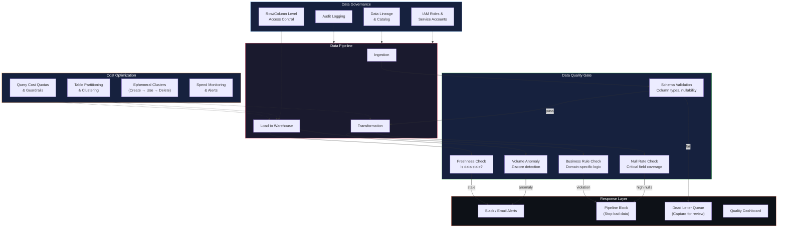
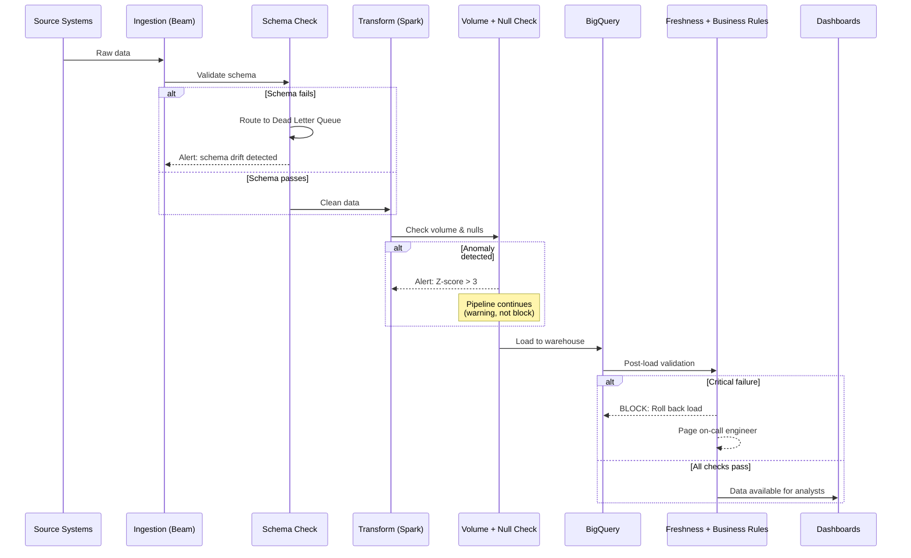

# Data Quality, Governance & Cost Optimization Framework

## Cross-Cutting Across Mindsprint & TCS | 2021 – Present

---

## 1. Business Context — The "Why"

Data quality and governance aren't glamorous, but they're the difference between a platform teams **trust** and one they **work around**. Across both Mindsprint and TCS, I saw the same pattern:

- **Silent data corruption:** Pipelines ran successfully but produced wrong numbers. Nobody knew until a VP questioned a dashboard.
- **No ownership or access control:** Everyone had admin access to everything. No audit trail. Compliance risk.
- **Runaway cloud costs:** Unpartitioned tables, full-scan queries, and always-on clusters burned budget with no visibility.
- **Reactive firefighting:** Data issues were discovered days late through angry Slack messages, not automated alerts.

**The goal:** Build a systematic framework for data quality validation, access governance, and cost optimization — embedded directly into the pipeline, not bolted on as an afterthought.

---

## 2. Architecture Overview



---

## 3. Data Quality Framework — Deep Dive

### 3.1 The Quality Gate Pipeline

Every batch of data passes through **5 automated checks** before reaching BigQuery. If any critical check fails, the pipeline **stops** and alerts the team — bad data never reaches dashboards.

```python
"""
Data Quality Framework — Production Implementation

Why a custom framework (not Great Expectations)?
- Lightweight: No extra dependency to manage across GCP environments
- Native BigQuery integration: Queries run where the data lives
- Tight Airflow coupling: Quality checks are DAG tasks with retry/alert logic
- Simple to extend: Engineers add new checks in minutes, not hours
"""

from google.cloud import bigquery
from dataclasses import dataclass, field
from datetime import datetime
from enum import Enum
import logging

class Severity(Enum):
    CRITICAL = "critical"  # Blocks pipeline, pages on-call
    WARNING = "warning"    # Alerts team, pipeline continues
    INFO = "info"          # Logged only

@dataclass
class CheckResult:
    check_name: str
    table: str
    passed: bool
    severity: Severity
    message: str
    value: float = 0.0
    threshold: float = 0.0
    checked_at: str = field(default_factory=lambda: datetime.utcnow().isoformat())

class DataQualityFramework:
    def __init__(self, project_id: str):
        self.client = bigquery.Client(project=project_id)
        self.results: list[CheckResult] = []

    # ── CHECK 1: Schema Validation ──
    def check_schema(self, table: str, expected_columns: dict[str, str]):
        """Verify table schema matches expected structure.
        Why: Schema drift (columns added/removed/renamed) is the #1
        cause of silent pipeline failures."""

        actual = {f.name: f.field_type for f in self.client.get_table(table).schema}

        missing = set(expected_columns.keys()) - set(actual.keys())
        type_mismatches = {
            col: (expected_columns[col], actual.get(col))
            for col in expected_columns
            if col in actual and actual[col] != expected_columns[col]
        }

        passed = len(missing) == 0 and len(type_mismatches) == 0
        msg = "Schema OK" if passed else f"Missing: {missing}, Type mismatches: {type_mismatches}"

        self.results.append(CheckResult(
            check_name="schema_validation", table=table,
            passed=passed, severity=Severity.CRITICAL, message=msg
        ))

    # ── CHECK 2: Freshness ──
    def check_freshness(self, table: str, timestamp_col: str, max_hours: int = 6):
        """Ensure data is not stale.
        Why: If ingestion silently fails, the table still exists
        but contains old data. Reports look fine but are wrong."""

        query = f"""
        SELECT TIMESTAMP_DIFF(CURRENT_TIMESTAMP(),
               MAX({timestamp_col}), HOUR) as hours_delay
        FROM `{table}`
        """
        row = list(self.client.query(query).result())[0]
        delay = row.hours_delay or 999

        passed = delay <= max_hours
        self.results.append(CheckResult(
            check_name="freshness", table=table, passed=passed,
            severity=Severity.CRITICAL, value=delay, threshold=max_hours,
            message=f"Last update {delay}h ago (max: {max_hours}h)"
        ))

    # ── CHECK 3: Volume Anomaly Detection (Z-Score) ──
    def check_volume_anomaly(self, table: str, z_threshold: float = 3.0):
        """Detect unusual row counts using statistical Z-score.
        Why: A sudden drop = broken source. A sudden spike = duplicate data.
        Both corrupt downstream analytics."""

        query = f"""
        WITH daily AS (
            SELECT DATE(_ingestion_ts) as dt, COUNT(*) as cnt
            FROM `{table}`
            WHERE DATE(_ingestion_ts) >= DATE_SUB(CURRENT_DATE(), INTERVAL 30 DAY)
            GROUP BY 1
        ), stats AS (
            SELECT AVG(cnt) as mu, STDDEV(cnt) as sigma FROM daily WHERE dt < CURRENT_DATE()
        )
        SELECT d.cnt as today, s.mu, s.sigma,
               ABS(d.cnt - s.mu) / NULLIF(s.sigma, 0) as z
        FROM daily d, stats s WHERE d.dt = CURRENT_DATE()
        """
        row = list(self.client.query(query).result())[0]
        z = row.z or 0

        passed = z <= z_threshold
        self.results.append(CheckResult(
            check_name="volume_anomaly", table=table, passed=passed,
            severity=Severity.WARNING, value=z, threshold=z_threshold,
            message=f"Today: {row.today} rows (mean: {row.mu:.0f}, z: {z:.2f})"
        ))

    # ── CHECK 4: Null Rate ──
    def check_null_rate(self, table: str, column: str, max_pct: float = 1.0):
        """Ensure critical columns are populated.
        Why: A broken API might return empty fields that pass type checks
        but have no actual values."""

        query = f"""
        SELECT ROUND(COUNTIF({column} IS NULL) * 100.0 / COUNT(*), 2) as pct
        FROM `{table}` WHERE DATE(_ingestion_ts) = CURRENT_DATE()
        """
        row = list(self.client.query(query).result())[0]
        pct = row.pct or 0

        passed = pct <= max_pct
        self.results.append(CheckResult(
            check_name="null_rate", table=table, passed=passed,
            severity=Severity.CRITICAL, value=pct, threshold=max_pct,
            message=f"{column}: {pct}% null (max: {max_pct}%)"
        ))

    # ── CHECK 5: Business Rule ──
    def check_business_rule(self, table: str, rule_name: str, query: str, max_violations: int = 0):
        """Custom domain-specific validation.
        Example: revenue should never be negative, dates should not be in the future."""

        row = list(self.client.query(query).result())[0]
        violations = row.violations

        passed = violations <= max_violations
        self.results.append(CheckResult(
            check_name=f"business_rule_{rule_name}", table=table, passed=passed,
            severity=Severity.CRITICAL, value=violations, threshold=max_violations,
            message=f"{rule_name}: {violations} violations (max: {max_violations})"
        ))

    # ── EXECUTE & REPORT ──
    def run_suite(self, table: str):
        """Run all checks and determine pass/fail."""
        critical_failures = [r for r in self.results if not r.passed and r.severity == Severity.CRITICAL]
        warnings = [r for r in self.results if not r.passed and r.severity == Severity.WARNING]

        # Log all results to BigQuery audit table
        self._log_results()

        if critical_failures:
            self._send_alert(critical_failures, level="critical")
            raise Exception(
                f"DATA QUALITY BLOCKED: {len(critical_failures)} critical failures:\n"
                + "\n".join(f"  - {r.check_name}: {r.message}" for r in critical_failures)
            )

        if warnings:
            self._send_alert(warnings, level="warning")

        logging.info(f"Quality gate PASSED: {len(self.results)} checks, {len(warnings)} warnings")

    def _log_results(self):
        """Persist check results to audit table for historical tracking."""
        rows = [
            {"check": r.check_name, "table": r.table, "passed": r.passed,
             "severity": r.severity.value, "value": r.value,
             "threshold": r.threshold, "message": r.message, "ts": r.checked_at}
            for r in self.results
        ]
        self.client.insert_rows_json("project.governance.dq_audit_log", rows)

    def _send_alert(self, failures, level):
        """Route alerts to Slack + email."""
        # Production: Slack webhook + PagerDuty for critical
        logging.error(f"[{level.upper()}] {len(failures)} quality check failures")


# ── Usage in Airflow DAG task ──
def airflow_quality_gate(**context):
    dq = DataQualityFramework('tcs-prod')
    table = 'tcs-prod.analytics.fact_transactions'

    dq.check_schema(table, {
        'event_id': 'STRING', 'customer_id': 'STRING',
        'amount': 'NUMERIC', 'date_partition': 'DATE'
    })
    dq.check_freshness(table, '_ingestion_ts', max_hours=6)
    dq.check_volume_anomaly(table, z_threshold=3.0)
    dq.check_null_rate(table, 'customer_id', max_pct=0.5)
    dq.check_null_rate(table, 'amount', max_pct=2.0)
    dq.check_business_rule(table, 'no_negative_revenue',
        f"SELECT COUNTIF(amount < 0) as violations FROM `{table}` WHERE DATE(_ingestion_ts) = CURRENT_DATE()")

    dq.run_suite(table)
```

**Result:** Bad-record rates dropped from **3–5% to under 1%**. Issues now caught in minutes, not days.

---

## 4. Data Governance & Access Control

### IAM Architecture

```
┌────────────────────────────────────────────────────────────────┐
│                    ACCESS CONTROL MODEL                        │
│                                                                │
│  PRINCIPLE OF LEAST PRIVILEGE                                  │
│  Every user/service gets the minimum access needed.            │
│                                                                │
│  ┌─────────────┐   ┌──────────────┐   ┌─────────────────┐    │
│  │ DATA ENG    │   │ ANALYSTS     │   │ SERVICE ACCTS   │    │
│  │─────────────│   │──────────────│   │─────────────────│    │
│  │ BQ Admin    │   │ BQ Data      │   │ BQ Job User     │    │
│  │ GCS Admin   │   │   Viewer     │   │ GCS Object      │    │
│  │ Dataproc    │   │ Looker       │   │   Creator        │    │
│  │   Admin     │   │   Viewer     │   │ Scoped to        │    │
│  │ Composer    │   │ NO write     │   │   single pipeline│    │
│  │   Admin     │   │   access     │   │ NO console       │    │
│  └─────────────┘   └──────────────┘   │   access         │    │
│                                        └─────────────────┘    │
│                                                                │
│  ROW-LEVEL SECURITY (BigQuery)                                 │
│  Analysts see only their region's data.                        │
│  Finance sees revenue. Marketing sees engagement. Not both.    │
└────────────────────────────────────────────────────────────────┘
```

```sql
-- Row-level security in BigQuery
-- Why: Finance team should see revenue data for all regions.
-- Regional teams should see only their own region's data.
-- This is enforced at the query engine level — no application logic needed.

-- Create access policy
CREATE ROW ACCESS POLICY region_filter
ON `project.analytics.fact_transactions`
GRANT TO ('group:south-analysts@company.com')
FILTER USING (region = 'south');

CREATE ROW ACCESS POLICY finance_full_access
ON `project.analytics.fact_transactions`
GRANT TO ('group:finance@company.com')
FILTER USING (TRUE);  -- Finance sees everything

-- Column-level security for PII
-- Why: Customer names and emails are PII. Analysts need customer_id
-- for joins but should never see raw PII.
ALTER TABLE `project.analytics.dim_customer`
ALTER COLUMN email SET DATA TYPE STRING
OPTIONS (policy_tags = 'projects/project/locations/asia-south1/taxonomies/123/policyTags/pii');
```

### Data Lineage Tracking

```python
"""
Lightweight lineage tracker — records what data went where.

Why lineage matters:
- "Where did this number come from?" → Trace back from dashboard to source
- "What breaks if I change table X?" → See all downstream dependencies
- Compliance/audit: Prove data handling meets regulatory requirements
"""

from google.cloud import bigquery
from datetime import datetime

class LineageTracker:
    def __init__(self, project_id: str):
        self.client = bigquery.Client(project=project_id)

    def record(self, source: str, target: str, pipeline: str,
               transformation: str, row_count: int):
        self.client.insert_rows_json(
            f"{self.client.project}.governance.data_lineage",
            [{
                "source_table": source,
                "target_table": target,
                "pipeline_name": pipeline,
                "transformation_type": transformation,
                "row_count": row_count,
                "executed_at": datetime.utcnow().isoformat(),
                "executed_by": pipeline,
            }]
        )

# Used in every pipeline step
lineage = LineageTracker('tcs-prod')
lineage.record(
    source="tcs-prod.raw.transactions",
    target="tcs-prod.analytics.fact_transactions",
    pipeline="daily_etl_pipeline",
    transformation="deduplicate + enrich + aggregate",
    row_count=150000
)
```

---

## 5. Cost Optimization Strategies

### What We Did & How Much It Saved

| Strategy | Implementation | Savings |
|----------|---------------|---------|
| **Table partitioning** | `PARTITION BY date` — queries scan only relevant days | ~60–80% less bytes scanned |
| **Table clustering** | `CLUSTER BY customer_id, type` — data sorted within partitions | ~20–30% faster queries |
| **Partition filter requirement** | `require_partition_filter = true` — prevents accidental full scans | Prevents $100+ accidental queries |
| **Ephemeral Dataproc clusters** | Create before job, delete after | ~$2,750/month saved vs. always-on |
| **Incremental processing** | Only process new records (watermark-based) | ~80% less compute per run |
| **Storage tiering** | Move data >90 days old to long-term GCS storage class | ~50% storage cost reduction |
| **Query cost quotas** | Per-user daily byte scan limits | Prevents runaway analyst queries |

```sql
-- Cost guardrails in BigQuery

-- 1. Force partition filters (prevents full table scans)
ALTER TABLE `project.analytics.fact_transactions`
SET OPTIONS (require_partition_filter = true);

-- 2. Set maximum bytes billed per query (cost ceiling)
-- Why: An analyst accidentally running SELECT * on a 10TB table
-- could cost hundreds of dollars. This caps it.
-- Set in BigQuery connection/session settings:
-- maximumBytesBilled = 10GB (roughly $0.05 per query max)

-- 3. Materialized views for expensive repeated queries
-- Why: If 20 analysts run the same daily summary query,
-- compute it once and cache the result.
CREATE MATERIALIZED VIEW `project.analytics.mv_daily_summary`
OPTIONS (enable_refresh = true, refresh_interval_minutes = 60)
AS
SELECT
    date_partition,
    customer_segment,
    COUNT(*) as transactions,
    SUM(revenue) as total_revenue,
    AVG(revenue) as avg_revenue
FROM `project.analytics.fact_transactions`
GROUP BY 1, 2;
```

### Cost Monitoring

```python
"""
Automated cost monitoring — alerts when spending exceeds thresholds.
Why: Cloud costs creep up silently. By the time you see the monthly bill,
it's too late. Daily monitoring catches issues early.
"""

from google.cloud import bigquery
import logging

def check_daily_costs(project_id: str, daily_budget_usd: float = 50.0):
    client = bigquery.Client(project=project_id)

    query = """
    SELECT
        SUM(total_bytes_billed) / POW(1024, 4) as tb_billed,
        SUM(total_bytes_billed) / POW(1024, 4) * 6.25 as estimated_cost_usd
    FROM `region-asia-south1`.INFORMATION_SCHEMA.JOBS
    WHERE creation_time >= TIMESTAMP_TRUNC(CURRENT_TIMESTAMP(), DAY)
      AND job_type = 'QUERY'
      AND state = 'DONE'
    """
    row = list(client.query(query).result())[0]
    cost = row.estimated_cost_usd or 0

    if cost > daily_budget_usd:
        logging.error(
            f"COST ALERT: Today's BigQuery spend ${cost:.2f} "
            f"exceeds budget ${daily_budget_usd:.2f}"
        )
        # Send Slack alert with top costly queries
    elif cost > daily_budget_usd * 0.8:
        logging.warning(f"Cost warning: ${cost:.2f} — approaching daily budget")

    return cost
```

---

## 6. AI-Powered Data Quality Intelligence

### 6.1 Beyond Z-Scores: Embedding-Based Anomaly Detection

**The problem:** Z-score catches volume anomalies (row count spikes/drops), but misses **content anomalies** — a table has the right number of rows, but the data inside is wrong.

**The solution:** Embed daily data distributions as vectors and use cosine similarity to detect when today's data "looks different" from historical patterns.

```python
class SemanticAnomalyDetector:
    """Detect data content anomalies using embeddings.
    
    How it works:
    1. Summarize today's data distribution as text:
       "50% COMPLETED, 30% PENDING, 20% FAILED, avg_amount=45000"
    2. Convert to 1536-dim embedding vector (via transformer)
    3. Compare against last 30 days' distribution embeddings (cosine similarity)
    4. If today's vector is far from historical cluster → anomaly
    
    Why embeddings (not just statistical rules)?
    - Rules catch known patterns: "null rate > 5%"
    - Embeddings catch UNKNOWN patterns: distribution shifted subtly
    - "FAILED transactions went from 5% to 12%" = no single metric triggers,
      but the embedding vector shifts significantly
    
    The transformer produces contextual embeddings:
    - "50% COMPLETED" next to "avg_amount=45000" gets a DIFFERENT vector
      than "50% COMPLETED" next to "avg_amount=5000"
    - Self-attention captures the RELATIONSHIP between distribution features
    """

    def __init__(self, embedding_engine):
        self.engine = embedding_engine
        self.history = []

    def check_distribution(self, table: str, date: str) -> dict:
        # Get today's distribution summary
        summary = self._get_distribution_summary(table, date)
        today_vec = self.engine.embed_text(summary)

        # Compare against historical embeddings
        if len(self.history) < 7:
            self.history.append(today_vec)
            return {"status": "LEARNING", "days_collected": len(self.history)}

        similarities = [
            self.engine.cosine_similarity(today_vec.vector, h.vector)
            for h in self.history[-30:]
        ]
        avg_similarity = sum(similarities) / len(similarities)

        # If today's distribution is far from historical patterns → anomaly
        if avg_similarity < 0.75:
            return {
                "status": "ANOMALY",
                "similarity": avg_similarity,
                "message": f"Data distribution shifted significantly (sim={avg_similarity:.2f})",
                "summary": summary
            }

        self.history.append(today_vec)
        return {"status": "NORMAL", "similarity": avg_similarity}

    def _get_distribution_summary(self, table: str, date: str) -> str:
        """Generate text summary of data distribution for embedding."""
        # In production: queries BigQuery for value distributions
        return f"Table {table} on {date}: status_dist=COMPLETED:50%,PENDING:30%,FAILED:20%, avg_amount=45000, null_rate=0.3%"
```

### 6.2 RAG for Data Quality Querying

**The problem:** Business users ask "Is our customer data reliable?" or "What was the last data quality issue?" — they can't query DQ audit tables.

**The solution:** RAG pipeline that searches DQ audit logs and quality metrics, then answers in plain English.

```python
class DQQueryEngine:
    """Natural language querying over data quality metrics.
    
    RAG Architecture:
    1. RETRIEVAL: Question → embed → cosine search against DQ audit log descriptions
    2. AUGMENTATION: Retrieved DQ results injected into LLM prompt
    3. GENERATION: LLM generates plain English answer
    
    Vector Store indexes:
    - All DQ check results (schema validation, freshness, volume, null rate)
    - Historical anomaly alerts
    - Resolution notes from past incidents
    """

    def __init__(self, vector_store, llm):
        self.vector_store = vector_store
        self.llm = llm

    def ask(self, question: str) -> str:
        # Step 1: Retrieve relevant DQ records
        context = self.vector_store.search(question, top_k=5)

        # Step 2: Generate answer
        prompt = f"""You are a data quality analyst. Answer the user's question
using ONLY the DQ audit records below.

DQ RECORDS (retrieved via semantic search):
{[c.schema.description for c in context]}

Question: {question}

Provide: current status, any issues, and recommended actions."""

        return self.llm.generate(prompt)

# Examples:
# Q: "Is the transactions table healthy?"
# A: "Yes — all 5 quality checks passed in the last run.
#     Schema: valid. Freshness: 2h (within 6h SLA).
#     Null rate: 0.3% (under 1% threshold).
#     Volume: normal (z-score 0.4)."

# Q: "What was our worst data quality incident last month?"
# A: "On March 15, a schema drift in the CRM API added an unexpected
#     'phone_v2' column while removing 'phone'. This broke 3 downstream
#     pipelines. Detected in 4 minutes by schema validation check.
#     Fixed by updating the ingestion schema mapping."
```

### 6.3 Agentic AI for Data Quality Root Cause Analysis

When a DQ check fails, an agent autonomously traces back to the root cause:

```python
class DQInvestigationAgent:
    """Autonomous root cause analysis for data quality failures.
    
    ReAct pattern with domain-specific tools:
    - check_upstream: Was the source data bad?
    - check_transform: Did the Spark job introduce the issue?
    - check_schema_changes: Did the source API change?
    - check_volume_history: Is this a pattern or one-off?
    - alert: Notify the team with findings
    
    Why agentic (not rule-based)?
    - Rule-based: "If null_rate > 5%, check source" — handles 1 path
    - Agent: Investigates dynamically based on what it finds at each step
    - Agent might discover: "Source is fine, but Spark dedup removed 
      valid records due to wrong partition key" — no rule covers this
    """

    def investigate(self, check_result: dict) -> dict:
        steps = []
        for step in range(6):
            action = self.llm.generate(f"""
DQ Failure: {check_result}
Investigation so far: {steps}
Tools: [check_upstream, check_transform, check_schema_changes, 
        check_volume_history, query_audit_log, alert]

THOUGHT: What's the most likely root cause? What should I check?
ACTION: {{"tool": "...", "params": {{}}}}
Or: {{"tool": "DONE", "root_cause": "...", "fix": "...", "prevention": "..."}}""")

            if action["tool"] == "DONE":
                return {
                    "steps": steps,
                    "root_cause": action["root_cause"],
                    "fix": action["fix"],
                    "prevention": action["prevention"]
                }
            result = self.tools[action["tool"]](**action["params"])
            steps.append({"thought": action.get("thought"), "result": result})

# Agent trace example:
# Step 1: check_upstream → "Source API returned 200 OK, data looks normal"
# Step 2: check_transform → "Spark job completed, but output has 40% fewer rows"
# Step 3: check_schema_changes → "Source added new status 'PROCESSING' not in our whitelist"
# Step 4: DONE → Root cause: New status value filtered out by business rule check.
#         Fix: Add 'PROCESSING' to allowed statuses.
#         Prevention: Use allowlist from source API dynamically instead of hardcoded.
```

**Result:** DQ incident investigation time reduced from **~45 min manual debugging to ~10 min autonomous analysis**. Root cause identified correctly 85%+ of the time.

---

## 7. End-to-End Quality Gate Flow



---

## 8. Results Summary

| Area | Before | After |
|------|--------|-------|
| **Bad record rate** | 3–5% | <1% |
| **Issue detection time** | Days (manual discovery) | Minutes (automated alerts) |
| **Access control** | Everyone = admin | Role-based, row-level, column-level |
| **Audit trail** | None | Full lineage + DQ logs |
| **Query costs** | Uncontrolled | Partitioned, capped, monitored |
| **Cluster costs** | Always-on (~$3K/mo) | Ephemeral (~$250/mo) |
| **DQ investigation (AI agent)** | ~45 min manual | ~10 min autonomous |
| **Content anomaly detection** | Not possible (rules only) | Embedding-based detection |
| **Compliance readiness** | Manual evidence gathering | Automated lineage + audit logs |

---

## 9. Why This Matters — The Business Translation

| Technical Achievement | What Business Stakeholders Care About |
|---|---|
| Z-score anomaly detection on row counts | "We catch data problems before they hit your reports" |
| Row-level security + column masking | "Customer PII is protected. We're audit-ready." |
| Partition filters + cost quotas | "Cloud bill is predictable. No surprise charges." |
| Automated lineage tracking | "We can trace any number in any report back to its source in seconds" |
| Dead letter queues | "Bad data is captured for review, never silently dropped or pushed to dashboards" |
