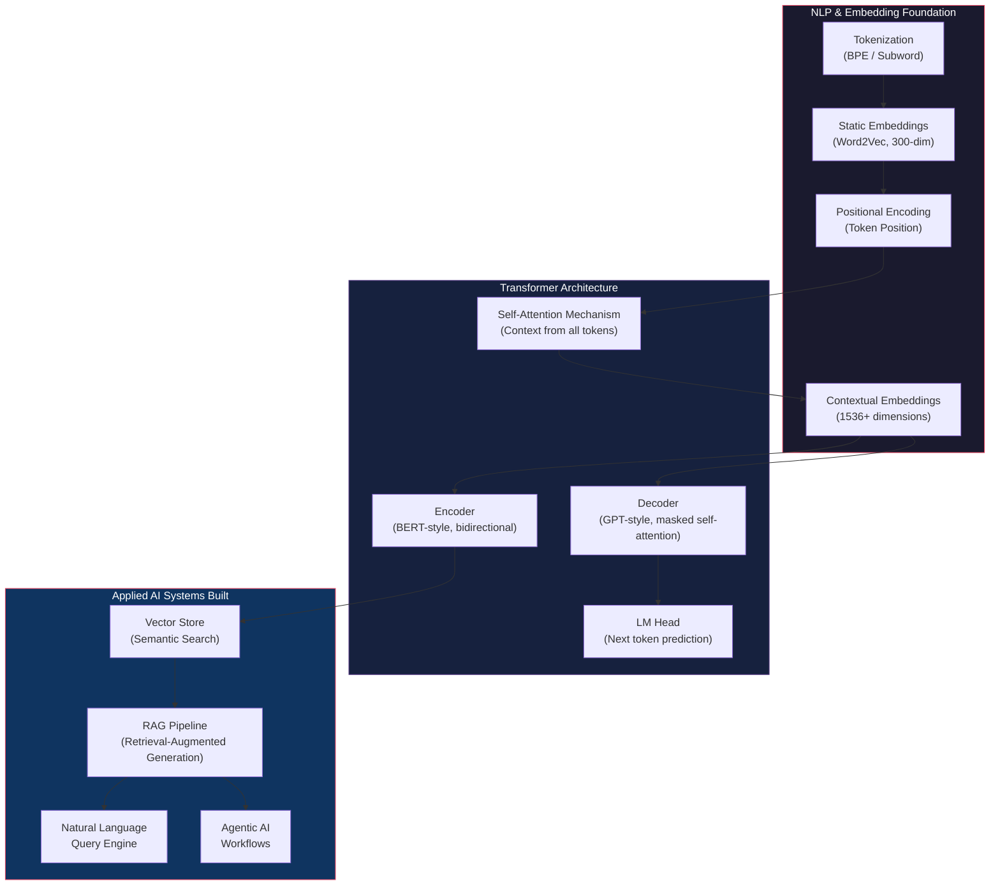

# AI & Generative AI Systems — Technical Deep Dive

## Mindsprint | Bengaluru | Oct 2024 – Present

---

## 1. Business Context

Enterprise clients had massive datasets in BigQuery but **non-technical stakeholders couldn't access them** without writing SQL. Every data question required a ticket to the data team, taking days. Meanwhile, data scientists needed semantic search across unstructured documents, and analysts needed automated insight generation.

**Goal:** Build AI-powered systems that democratize data access through natural language querying, automate analytical workflows, and enable semantic data discovery — all grounded in production data engineering infrastructure.

---

## 2. AI/NLP Foundation — How It All Connects



---

## 3. Embeddings — Converting Text to Numbers

### 3.1 Why Embeddings Matter

Machines cannot understand text. The entire AI pipeline starts with converting human language into **numerical vectors** that preserve semantic meaning. Without embeddings, no NLP, no LLMs, no RAG.

### 3.2 Static Embeddings (Word2Vec)

**What:** Each word gets a fixed 300-dimensional vector based on its meaning across 300 features (has_tail, weight, color, etc.). Trained using CBOW (Continuous Bag of Words) or Skip-gram architecture on large text corpora like Wikipedia.

**How similarity works — Cosine Similarity:**
```
distance = 1 - cos(θ)

Example:
- cat vector: [0.8, 0.1, 0.3, ..., 1.0]  (300 dims)
- dog vector: [0.9, 0.2, 0.5, ..., 0.8]  (300 dims)
- Angle between them: ~45°
- Distance: 1 - cos(45°) = 1 - 0.707 = 0.29 → CLOSE (similar)

- house vector: [0.1, 0.9, 0.2, ..., 0.1]
- Angle cat↔house: ~90°
- Distance: 1 - cos(90°) = 1 - 0 = 1.0 → FAR (dissimilar)
```

**Code — Word2Vec in Action:**
```python
import gensim.downloader as api

# Load pre-trained Word2Vec model (1.6GB, 300 dimensions)
model = api.load("word2vec-google-news-300")

# Get embedding for "cat" → 300-dimensional vector
cat_vector = model["cat"]
print(cat_vector.shape)  # (300,)

# Find similar words using cosine similarity
model.most_similar("dog")
# [('dogs', 0.87), ('puppy', 0.85), ('pitbull', 0.82), ...]
```

**Limitation:** Static embeddings give the SAME vector for a word regardless of context.
- "fan has three blades" → fan = ceiling fan
- "I am your fan" → fan = admirer
- Word2Vec gives SAME embedding for both → **WRONG**

### 3.3 Contextual Embeddings (Transformer-based)

**What:** Each word gets a DIFFERENT vector depending on the surrounding context. Achieved through **self-attention mechanism** in transformers. Modern models use 1536+ dimensions (vs Word2Vec's 300).

**Why this matters:**
```
"cats love dogs" → cats embedding captures: cats are the SUBJECT doing the loving
"dogs love cats" → cats embedding captures: cats are the OBJECT being loved

Same word "cats", DIFFERENT embeddings because POSITION and CONTEXT changed.
```

**How it's achieved:** The transformer block converts static embeddings into contextual embeddings using self-attention — each token attends to all other tokens to understand relationships.

---

## 4. Transformer Architecture — The Backbone of All Modern AI

### 4.1 How Transformers Work (Step by Step)

```
Input: "I want to eat chocolate"
                    ↓
┌─────────────────────────────────────────────┐
│              TRANSFORMER                     │
│                                              │
│  Step 1: TOKENIZER                           │
│  ├─ Tokenization: ["I", "want", "to",       │
│  │                  "eat", "chocolate"]       │
│  ├─ Token IDs:     [40, 1100, 1200, 45, 768]│
│  ├─ Static Embeddings: 1536-dim per token    │
│  └─ Position Encoding: [0, 1, 2, 3, 4]      │
│                    ↓                         │
│  Step 2: TRANSFORMER BLOCK STACK             │
│  ├─ Masked Self-Attention                    │
│  ├─ Each token attends to PREVIOUS tokens    │
│  ├─ Static → Contextual embeddings           │
│  └─ "chocolate" now has context of           │
│     "I want to eat"                          │
│                    ↓                         │
│  Step 3: LM HEAD                             │
│  ├─ Takes LAST token's contextual embedding  │
│  ├─ (because it has context of ALL previous) │
│  └─ Predicts NEXT token → "Good"             │
│                                              │
└─────────────────────────────────────────────┘
                    ↓
Output: "Good" (ONE token)

Then: "I want to eat chocolate Good" → Transformer → "choice"
Then: "I want to eat chocolate Good choice" → Transformer → "!"
... token by token until done.
```

### 4.2 Self-Attention — The Core Innovation

**Masked Self-Attention (used in GPT/ChatGPT):**
- Each token can ONLY attend to previous tokens (not future ones)
- "eat" attends to → "I", "want", "to" (NOT "chocolate")
- "chocolate" attends to → "I", "want", "to", "eat" (has FULL context)
- That's why the LAST token goes to LM Head — it has the most context

**Bidirectional Self-Attention (used in BERT):**
- Each token attends to ALL tokens (past AND future)
- Used for understanding/encoding tasks, not generation

### 4.3 Encoder vs Decoder Models

| Model Type | Architecture | Self-Attention | Use Case | Examples |
|---|---|---|---|---|
| **Encoder-only** | Encoder | Bidirectional | Understanding, classification, embeddings | BERT |
| **Decoder-only** | Decoder | Masked (left-to-right) | Text generation | GPT-3, GPT-4, ChatGPT |
| **Encoder-Decoder** | Both | Both | Translation, summarization | T5, BART |

### 4.4 Tokenization — Model-Dependent

```
Same input, different models, different tokens:

GPT-4:  "10kilometers" → ["10", "k", "ms"]     (3 tokens)
DaVinci: "10kilometers" → ["10", "kms"]          (2 tokens)

Key insight: Tokens are MODEL-SPECIFIC. Each model has its own
vocabulary and tokenization strategy (BPE, WordPiece, etc.)
Token count affects cost (APIs charge per token) and context window.
```

---

## 5. RAG Pipeline — What We Built

### 5.1 Why RAG (Not Just LLM)

LLMs have a knowledge cutoff and don't know your private enterprise data. RAG solves this by **retrieving** relevant context from your data, then **augmenting** the LLM prompt with that context before **generating** a response.

```mermaid
graph LR
    Q["User Question:<br/>'Top 5 customers<br/>by revenue?'"] --> EMB["Embedding Model<br/>(Vertex AI text-embedding-004)<br/>Convert question → 1536-dim vector"]
    EMB --> VS["Vector Store<br/>(Semantic Search)<br/>Find similar schema/<br/>metadata embeddings"]
    VS --> CTX["Retrieved Context:<br/>- fact_events table schema<br/>- dim_customer columns<br/>- Sample SQL queries"]
    CTX --> LLM["LLM (Gemini 1.5 Pro)<br/>Generate SQL using<br/>retrieved context"]
    LLM --> SQL["Generated SQL:<br/>SELECT customer_id,<br/>SUM(revenue)..."]
    SQL --> BQ["BigQuery<br/>Execute query"]
    BQ --> ANS["LLM Summarizes:<br/>'Top 5 customers are:<br/>1. Acme Corp $2.3M...'"]
    ANS --> USER["Business User<br/>Gets answer in<br/>plain English"]

    style Q fill:#e94560,stroke:#fff,color:#fff
    style EMB fill:#533483,stroke:#fff,color:#fff
    style VS fill:#0f3460,stroke:#fff,color:#fff
    style LLM fill:#e94560,stroke:#fff,color:#fff
    style BQ fill:#16213e,stroke:#fff,color:#fff
    style USER fill:#1a1a2e,stroke:#e94560,color:#fff
```



### 5.2 Vector Store — Semantic Search Over Schema Metadata

```python
from vertexai.language_models import TextEmbeddingModel
import numpy as np

class SchemaVectorStore:
    """Store table/column descriptions as embeddings for semantic retrieval.
    
    Why vector search (not keyword search)?
    - User asks "revenue by region" → keyword search won't match 
      column named "total_amount" in table "fact_transactions"
    - Vector search matches by MEANING: revenue ≈ total_amount (cosine similarity)
    """

    def __init__(self):
        self.model = TextEmbeddingModel.from_pretrained("text-embedding-004")
        self.embeddings = []  # list of (embedding_vector, metadata)

    def index_schema(self, tables: dict):
        """Convert every table/column description into a 1536-dim vector."""
        for table_name, info in tables.items():
            # Embed table description
            text = f"Table: {table_name}. {info['description']}. "
            text += "Columns: " + ", ".join(
                f"{col} ({desc})" for col, desc in info['columns'].items()
            )
            embedding = self.model.get_embeddings([text])[0].values
            self.embeddings.append((embedding, {"table": table_name, "info": info}))

    def search(self, query: str, top_k: int = 3):
        """Find most relevant tables for a natural language question.
        Uses cosine similarity — same math as Word2Vec but in 1536 dims."""
        query_emb = self.model.get_embeddings([query])[0].values

        scores = []
        for emb, metadata in self.embeddings:
            # Cosine similarity: 1 - (angle between vectors)
            similarity = np.dot(query_emb, emb) / (
                np.linalg.norm(query_emb) * np.linalg.norm(emb)
            )
            scores.append((similarity, metadata))

        # Return top-k most similar schemas
        scores.sort(key=lambda x: x[0], reverse=True)
        return [meta for _, meta in scores[:top_k]]
```

### 5.3 Full RAG Query Engine

```python
from vertexai.generative_models import GenerativeModel
from google.cloud import bigquery

class RAGQueryEngine:
    """Natural language → SQL → Answer pipeline.
    
    Architecture:
    1. User question → embed with text-embedding-004 (1536 dims)
    2. Semantic search against schema vector store (cosine similarity)
    3. Retrieved schemas + question → Gemini generates SQL
    4. Execute SQL on BigQuery
    5. Results + question → Gemini generates natural language answer
    """

    def __init__(self, project_id: str):
        self.bq = bigquery.Client(project=project_id)
        self.llm = GenerativeModel("gemini-1.5-pro")
        self.vector_store = SchemaVectorStore()
        self._index_enterprise_schemas()

    def _index_enterprise_schemas(self):
        """Pre-index all BigQuery table schemas into vector store."""
        schemas = {
            "analytics.fact_events": {
                "description": "Transaction events with revenue and quantities",
                "columns": {
                    "customer_id": "Unique customer identifier",
                    "revenue": "Transaction revenue in INR",
                    "event_type": "purchase, refund, or signup",
                    "created_date": "Event date (partition key)",
                    "customer_segment": "enterprise, mid_market, smb",
                }
            },
            "analytics.dim_customer": {
                "description": "Customer dimension with demographics",
                "columns": {
                    "customer_id": "Join key to fact tables",
                    "customer_segment": "Business size category",
                    "region": "Geographic region",
                    "lifetime_value": "Total historical revenue",
                }
            }
        }
        self.vector_store.index_schema(schemas)

    def query(self, question: str) -> dict:
        # Step 1: Retrieve relevant schemas via semantic search
        relevant_schemas = self.vector_store.search(question, top_k=3)

        # Step 2: Generate SQL with LLM + retrieved context
        prompt = f"""You are a BigQuery SQL expert. Generate SQL to answer the question.

AVAILABLE SCHEMAS (retrieved via semantic search):
{relevant_schemas}

QUESTION: {question}

RULES:
- Use ONLY listed tables/columns
- Always include partition filter (WHERE created_date ...)
- Standard BigQuery SQL syntax
- Return ONLY SQL, no explanation"""

        sql = self.llm.generate_content(prompt).text.strip().strip('```sql').strip('```')

        # Step 3: Execute on BigQuery
        results = [dict(row) for row in self.bq.query(sql).result()]

        # Step 4: Summarize in natural language
        summary = self.llm.generate_content(
            f'Question: "{question}"\nSQL Results: {results[:20]}\n'
            f'Give a clear, concise answer with key numbers.'
        ).text

        return {"question": question, "sql": sql, "answer": summary}

# Usage
engine = RAGQueryEngine("mindsprint-prod")
result = engine.query("What were top 5 customers by revenue last quarter?")
# Answer: "Top 5 customers in Q4: 1) Acme Corp (₹23L), 2) TechNova (₹18L)..."
```

---

## 6. Agentic AI — Autonomous Data Analysis

**Why agents (not just RAG)?** RAG answers ONE question. An agent takes a complex OBJECTIVE and breaks it into MULTIPLE steps autonomously — querying data, interpreting results, deciding what to investigate next.

```python
class DataAnalysisAgent:
    """Multi-step autonomous analysis agent.
    
    How it differs from RAG:
    - RAG: Question → Retrieve → Generate → Answer (1 step)
    - Agent: Objective → Plan → Execute Step 1 → Interpret → 
             Decide next step → Execute Step 2 → ... → Final Summary
    
    Uses the same transformer/LLM foundation:
    - Tokenization → embeddings → self-attention → token generation
    - But wrapped in an autonomous loop with tool access
    """

    def __init__(self, project_id: str):
        self.bq = bigquery.Client(project=project_id)
        self.llm = GenerativeModel("gemini-1.5-pro")
        self.tools = {
            "run_sql": self._execute_query,
            "get_schema": self._get_table_schema,
            "alert": self._send_alert,
        }

    def run(self, objective: str) -> dict:
        """Run autonomous multi-step analysis."""
        history = []

        for step in range(10):  # Max 10 steps
            # LLM decides what to do next based on history
            # Under the hood: tokenize prompt → transformer blocks →
            # masked self-attention → LM head → next action token by token
            prompt = f"""Objective: {objective}
Steps taken so far: {history}
Available tools: {list(self.tools.keys())}

What's your next action? Return JSON:
{{"tool": "tool_name", "params": {{}}, "reasoning": "why"}}
Or if done: {{"tool": "DONE", "summary": "findings"}}"""

            action = json.loads(self.llm.generate_content(prompt).text)

            if action["tool"] == "DONE":
                return {"steps": history, "summary": action["summary"]}

            # Execute tool and record result
            result = self.tools[action["tool"]](**action["params"])
            history.append({
                "step": step + 1,
                "tool": action["tool"],
                "reasoning": action["reasoning"],
                "result": str(result)[:500]
            })

        return {"steps": history, "summary": "Max steps reached"}

# Usage: Agent autonomously investigates revenue drop
agent = DataAnalysisAgent("mindsprint-prod")
result = agent.run("Why did revenue drop 15% yesterday vs 7-day avg?")
# Agent autonomously:
# Step 1: Queries daily revenue trend
# Step 2: Identifies enterprise segment dropped 40%
# Step 3: Drills into enterprise → finds 2 large accounts churned
# Step 4: Checks if data quality issue or real → confirms real
# Step 5: Generates summary with root cause + recommendation
```

---

## 7. Prompting Techniques Used

| Technique | What It Does | Where We Used It |
|---|---|---|
| **Zero-shot** | No examples, just instruction | Simple SQL generation |
| **Few-shot** | Include 2-3 examples in prompt | Complex join queries |
| **Chain-of-thought** | "Think step by step" | Multi-table analysis |
| **ReAct** | Reasoning + Acting loop | Agentic AI workflows |
| **System prompts** | Set role and constraints | "You are a BigQuery SQL expert" |

---

## 8. Technical Decisions — Why These Choices

| Decision | Choice | Why |
|---|---|---|
| Embedding model | Vertex AI text-embedding-004 (1536 dims) | Native GCP, higher dims than Word2Vec (300) = richer semantic meaning |
| LLM | Gemini 1.5 Pro | Native GCP integration, 1M token context window, enterprise-grade |
| Vector search | Custom cosine similarity | Lightweight, no external vector DB dependency for small schema catalog |
| RAG over fine-tuning | RAG pipeline | Schema changes frequently; RAG adapts without retraining |
| Agent framework | Custom Python | Full control, no LangChain overhead, tight Airflow integration |
| Self-attention type | Masked (decoder-only) | Generation tasks need left-to-right prediction, not bidirectional |

---

## 9. Results & Impact

| Metric | Before | After |
|--------|--------|-------|
| Data access for non-tech users | Zero (SQL only) | Self-serve via natural language |
| Time to answer data questions | Days (ticket-based) | Seconds (real-time NL query) |
| Analyst investigation time | Hours of manual SQL | Minutes (agentic automation) |
| Data team ticket volume | High | Reduced significantly |
| Semantic search accuracy | N/A | High (1536-dim contextual embeddings) |
